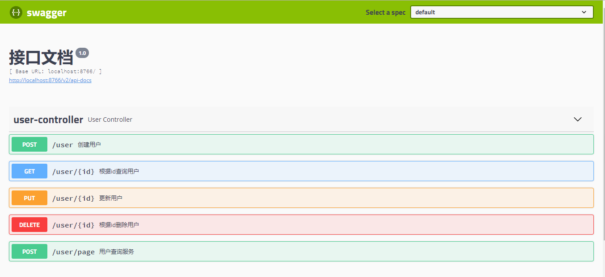

# 项目名restfu-api-demo

#### 基于 Spring Boot 2.1.6.RELEASE

## 介绍
 
   
   >RESTFUL是一种网络应用程序的设计风格和开发方式，基于HTTP，可以使用XML格式定义或JSON格式定义。RESTFUL适用于移动互联网厂商作为业务使能接口的场景，实现第三方OTT调用移动网络资源的功能，动作类型为新增、变更、删除所调用资源

# 注意事项
### 1.maven 依赖
```maven
 <!-- springCloud 主要用于jar包的版本控制 -->
        <dependency>
            <groupId>org.springframework.cloud</groupId>
            <artifactId>spring-cloud-dependencies</artifactId>
            <version>${spring-cloud.version}</version>
            <type>pom</type>
            <scope>import</scope>
        </dependency>

        <dependency>
            <groupId>org.apache.commons</groupId>
            <artifactId>commons-lang3</artifactId>
            <version>${commons-lang3.version}</version>
        </dependency>
        <dependency>
            <groupId>org.projectlombok</groupId>
            <artifactId>lombok</artifactId>
        </dependency>
        <dependency>
            <groupId>org.springframework.boot</groupId>
            <artifactId>spring-boot-starter-web</artifactId>
        </dependency>
        <dependency>
            <groupId>org.springframework.boot</groupId>
            <artifactId>spring-boot-starter-test</artifactId>
        </dependency>
        <dependency>
            <groupId>org.springframework.boot</groupId>
            <artifactId>spring-boot-starter-aop</artifactId>
        </dependency>
        <dependency>
            <groupId>org.springframework.data</groupId>
            <artifactId>spring-data-commons</artifactId>
            <version>${data-commons.version}</version>
        </dependency>

        <dependency>
            <groupId>commons-io</groupId>
            <artifactId>commons-io</artifactId>
            <version>${commons-io.version}</version>
        </dependency>
        <dependency>
            <groupId>commons-lang</groupId>
            <artifactId>commons-lang</artifactId>
            <version>${commons-lang.version}</version>
        </dependency>
        <dependency>
            <groupId>commons-collections</groupId>
            <artifactId>commons-collections</artifactId>
            <version>${commons-collections.version}</version>
        </dependency>
        <dependency>
            <groupId>commons-beanutils</groupId>
            <artifactId>commons-beanutils</artifactId>
            <version>${commons-beanutils.version}</version>
        </dependency>

        <!-- RESTful APIs swagger2  -->
        <dependency>
            <groupId>io.springfox</groupId>
            <artifactId>springfox-swagger2</artifactId>
            <version>${swagger.version}</version>
        </dependency>
        <dependency>
            <groupId>io.springfox</groupId>
            <artifactId>springfox-swagger-ui</artifactId>
            <version>${swagger.version}</version>
        </dependency>

        <dependency>
            <groupId>cn.hutool</groupId>
            <artifactId>hutool-all</artifactId>
            <version>${hutool.version}</version>
        </dependency>
```

### 2.分组校验
实体类定义如下：
```java
public class User implements Serializable  {
    private static final long serialVersionUID = 1838417777538323571L;

    //主键
    @NotNull(message = "主键不能为空",groups =Update.class)
    private Long id;
    //用户名
    @NotNull(message = "用户名不能为空")
    private String userName;
    //密码
    @NotNull(message = "密码不能为空")
    private String password;
    //性别
    @NotNull(message = "性别不能为空")
    private String sex;


    public @interface Update {
    }
}
```
控制层代码,BindingResult bindingResult  必须写在方法的接收参数上，否则校验失败，校验逻辑统一走@FwValidate切面处理
```java
/**
     * 添加用户
     * @Author xuyisu
     * @Date 2019/10/25
     * @Param [user]
     * @Return com.yisu.common.result.FwResult
     */
    @PostMapping
    @ApiOperation(value = "创建用户")
    @FwValidate
    public FwResult createUser(@Valid @RequestBody User user,BindingResult bindingResult) {
        if(bindingResult.hasErrors())
        {
            return FwResult.failed();
        }
        FwResult userInfo=userService.createUser(user);
        return userInfo;
    }

    /**
     * 更新用户
     * @Author xuyisu
     * @Date 2019/10/25
     * @Param [user]
     * @Return com.yisu.common.result.FwResult
     */
    @PutMapping("/{id:\\d+}")
    @ApiOperation(value = "更新用户")
    @FwValidate
    public FwResult updateUser(@Validated(User.Update.class) @RequestBody User user,BindingResult bindingResult) {
        if(bindingResult.hasErrors())
        {
            return FwResult.failed();
        }
        FwResult userInfo=userService.updateUser(user);
        return userInfo;
    }
```
### 3.swagger  配置
```java
/**
 * api页面 /swagger-ui.html
 * @author xuyisu
 * @date 2019-10-15
 */

@Configuration
@EnableSwagger2
public class SwaggerConfig {


    @Value("${swagger.enabled}")
    private Boolean enabled;

    @Bean
    public Docket createRestApi() {
        return new Docket(DocumentationType.SWAGGER_2)
                .enable(enabled)
                .apiInfo(apiInfo())
                .select()
                .paths(Predicates.not(PathSelectors.regex("/error.*")))
                .build();
    }

    private ApiInfo apiInfo() {
        return new ApiInfoBuilder()
                .title("接口文档")
                .version("1.0")
                .build();
    }

}
```
浏览器输入`http://localhost:8766/swagger-ui.html# `


### 4.单元测试
```java
/**
 * @ClassName UserControllerTest
 * @Author xuyisu
 * @Description 模拟http测试
 * @Date 2019/10/25
 */
@RunWith(SpringRunner.class)
@SpringBootTest(webEnvironment = SpringBootTest.WebEnvironment.RANDOM_PORT)
public class UserControllerTest {

    @Autowired
    private WebApplicationContext wac;

    private MockMvc mockMvc;

    @Before
    public void setup() {
        mockMvc = MockMvcBuilders.webAppContextSetup(wac).build();
    }

    @Test
    public void whenGetUserInfoSuccess() throws Exception {
        String result = mockMvc.perform(get("/user/1")
                .contentType(MediaType.APPLICATION_JSON_UTF8))
                .andExpect(status().isOk())
                .andExpect(jsonPath("$.code").value(FwCommonConstants.SUCCESS))
                .andReturn().getResponse().getContentAsString();

        System.out.println(result);
    }
    //.......
    //具体请看代码`com.yisu.mock.UserControllerTest`

```

# 亲，点个star再走呗


